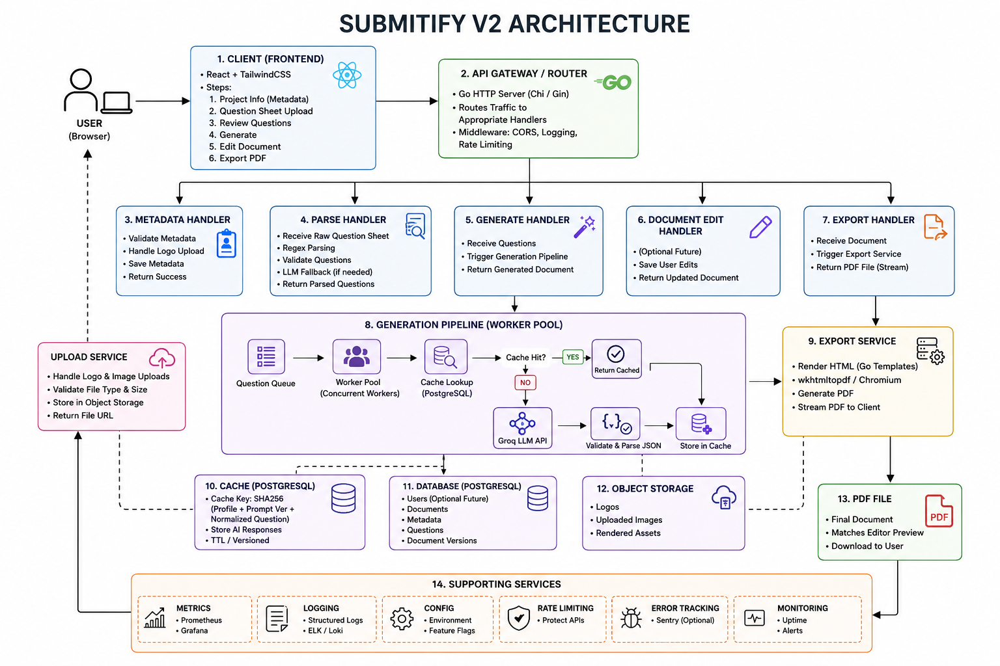

# Submitify V2 Architecture

## Overview

Submitify V2 is an AI-powered academic document generation platform designed for college practical files and laboratory records.

Unlike traditional AI document generators, Submitify separates **content generation**, **document editing**, and **PDF rendering** into independent stages.

The AI is responsible only for generating structured content.

The editor becomes the **Single Source of Truth**, ensuring that the exported PDF is always identical to what the user sees.

---

# Design Principles

## 1. AI generates content only

AI never generates HTML.

AI never generates PDF.

AI never decides layout.

AI only returns structured sections.

Example:

```json
{
  "Algorithm": "...",
  "Source Code": "...",
  "Output": "..."
}
```

---

## 2. Editor is the Single Source of Truth

Everything displayed inside the editor is stored in a Document Model.

The export service simply renders that model.

```
Editor
      ↓
Document Model
      ↓
Renderer
      ↓
PDF
```

No regeneration happens during export.

---

## 3. Stateless AI

Every AI request is independent.

The backend never stores conversation history.

Only reusable question generations are cached.

---

# High-Level Architecture



---

# Backend Architecture

```
internal/

├── api/
│
├── builder/
│
├── cache/
│
├── config/
│
├── database/
│
├── handlers/
│
├── llm/
│
├── metrics/
│
├── middleware/
│
├── models/
│
├── parser/
│
├── repository/
│
├── service/
│
├── uploads/
│
└── validator/
```

---

# Request Flow

## Step 1 — Metadata

The user enters:

- University
- Department
- Subject
- Subject Code
- Semester
- Course
- Language
- Student Name
- Roll Number
- Faculty
- Logo

No AI is involved.

---

## Step 2 — Question Parsing

User pastes a raw question sheet.

Example:

```
1 Reverse a Linked List

2 Reverse an Array

3 Binary Search
```

Parser Pipeline

```
Raw Text

    ↓

Regex Parser

    ↓

Validation

    ↓

LLM Fallback (if parsing fails)

    ↓

Questions[]
```

Output

```go
[]Question{
    {
        Number:1,
        Text:"Reverse a Linked List",
    },
    {
        Number:2,
        Text:"Reverse an Array",
    },
}
```

---

## Step 3 — Review

Before AI generation the user can

- Edit questions
- Delete questions
- Add new questions
- Reorder automatically

No AI yet.

---

# AI Generation Pipeline

After clicking Generate

```
Questions

      ↓

Worker Pool

      ↓

Generate Question

      ↓

Cache Lookup

      ↓

Cache Hit?

      │

 ┌────┴────┐

 YES      NO

 │         │

 ▼         ▼

Return    Groq API

             │

             ▼

      Validate JSON

             ▼

      Store in Cache

             ▼

Return Content
```

---

# Worker Pool

Questions are generated concurrently.

```
Questions

Q1

Q2

Q3

Q4

Q5

        │

        ▼

+----------------------+

Worker 1

Worker 2

Worker 3

Worker 4

Worker 5

+----------------------+

        │

        ▼

Results

        ▼

Sorted by Question Number

        ▼

Builder
```

Advantages

- Faster generation
- Better CPU utilization
- Independent retries
- Easy scaling

---

# Retry Mechanism

Each question retries independently.

```
Question

Attempt 1

↓

Failed

↓

Attempt 2

↓

Failed

↓

Attempt 3

↓

Success
```

Only failed questions retry.

---

# Cache Architecture

Submitify uses PostgreSQL as an AI response cache.

Purpose

- Reduce AI cost
- Improve latency
- Reuse identical generations

---

## Cache Key

```
SHA256(

Profile

+

Prompt Version

+

Normalized Question

)
```

(Currently Subject is also included in V2.)

---

## Cache Lookup

```
Question

↓

Normalize

↓

Build SHA256

↓

Database Lookup

↓

Found?

YES → Return

NO → Generate
```

---

## Cache Storage

Cached response contains

```
CacheEntry

ID

Cache Key

Subject

Normalized Question

Profile

Prompt Version

Response JSON

Hit Count

Created At

Last Used
```

Only AI response sections are stored.

Question number is intentionally excluded.

---

# Document Builder

Builder converts AI output into the complete document.

```
Metadata

+

Profile

+

Generated Questions

↓

Document Builder

↓

Document Model
```

---

# Document Model

```
Document

Metadata

Profile

Experiments[]

Experiment

Number

Question

Sections[]

Section

Title

Type

Content
```

---

# React Document Editor

Editor renders the Document Model.

Features

- Editable headings
- Editable paragraphs
- Editable code
- Insert sections
- Insert images
- Text formatting
- Live preview

No AI is used inside the editor.

---

# Export Pipeline

```
Document Model

↓

POST /export/pdf

↓

Node Export Service

↓

HTML Renderer

↓

Chromium

↓

PDF
```

PDF is generated from the same document shown in the editor.

---

# Image Upload Architecture

User uploads logo

↓

tmp/uploads/

↓

React displays

↓

PDF uses image

↓

Image deleted after export

Temporary uploads prevent unnecessary storage growth.

---

# Logging

Generation Logs

```
Question

Attempt

Duration

Status
```

Cache Logs

```
CACHE HIT

CACHE MISS

CACHE SAVE
```

These logs simplify debugging and performance monitoring.

---

# Frontend Architecture

```
React

Create Document

│

├── Project Info

├── Question Sheet

├── Review Questions

└── Document Editor
```

---

# Frontend Flow

```
Landing Page

↓

Project Information

↓

Paste Questions

↓

Review Questions

↓

Generate

↓

Document Editor

↓

Export PDF
```

---

# Services

## Parse Service

Responsible for

- Parsing question sheets
- Validation
- LLM fallback

---

## Generate Service

Responsible for

- Worker pool
- Retry logic
- Cache lookup
- AI generation
- Document building

---

## Export Service

Responsible for

- Sending document to renderer
- Returning PDF
- Temporary image cleanup

---

# Technology Stack

## Frontend

- React
- Vite
- CSS
- Context API

---

## Backend

- Go
- PostgreSQL
- pgx
- Worker Pool
- SHA256 Cache

---

## AI

- Groq
- Llama 3.3 70B

---

## Database

- Neon PostgreSQL

---

## PDF Rendering

- Node.js
- HTML Templates
- Headless Chromium

---

# Design Decisions

### Why Worker Pool?

- Parallel generation
- Better throughput
- Faster user experience

---

### Why PostgreSQL Cache?

- Persistent
- Fast lookups
- Analytics friendly
- Simple deployment

---

### Why Temporary Uploads?

User-uploaded logos are required only during PDF generation.

Images are stored in

```
tmp/uploads/
```

and automatically deleted after successful export.

---

### Why Single Source of Truth?

Avoids inconsistencies.

```
Editor

↓

Document Model

↓

PDF
```

No duplicated state.

---

# Future Improvements

- Improved semantic normalization
- Cache analytics dashboard
- Cache cleanup scheduler
- Multi-language generation
- Additional document templates
- User accounts and cloud storage
- Collaborative editing

---

# Architecture Summary

```
User
 │
 ▼
Metadata + Questions
 │
 ▼
Parse Service
 │
 ▼
Question Review
 │
 ▼
Generate Service
 │
 ├────────────── Cache (PostgreSQL)
 │                     │
 │                     ▼
 │                 Cache Hit
 │
 ▼
Groq AI
 │
 ▼
Builder
 │
 ▼
Document Model
 │
 ▼
Document Editor
 │
 ▼
Export Service
 │
 ▼
Chromium Renderer
 │
 ▼
PDF
```

---

**Version:** Submitify V2.0

**Architecture Style:** Layered Architecture + Service-Oriented Design + Worker Pool + Cache-Aside Pattern