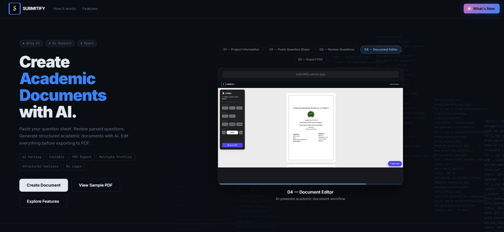
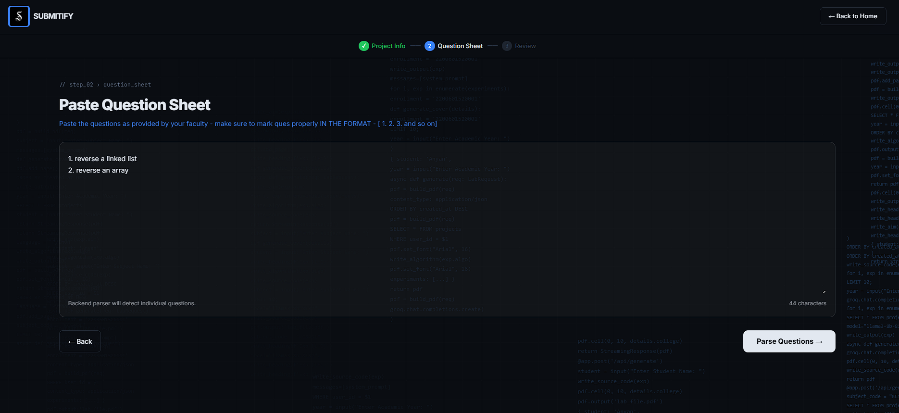
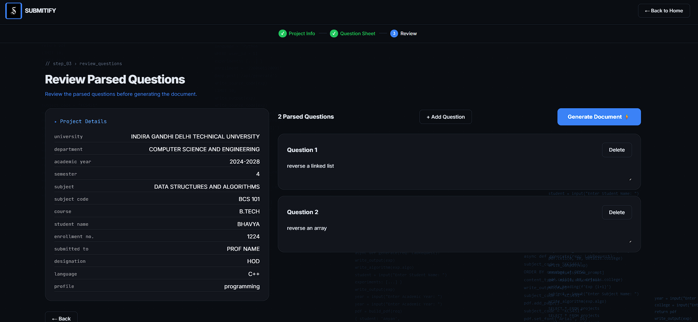
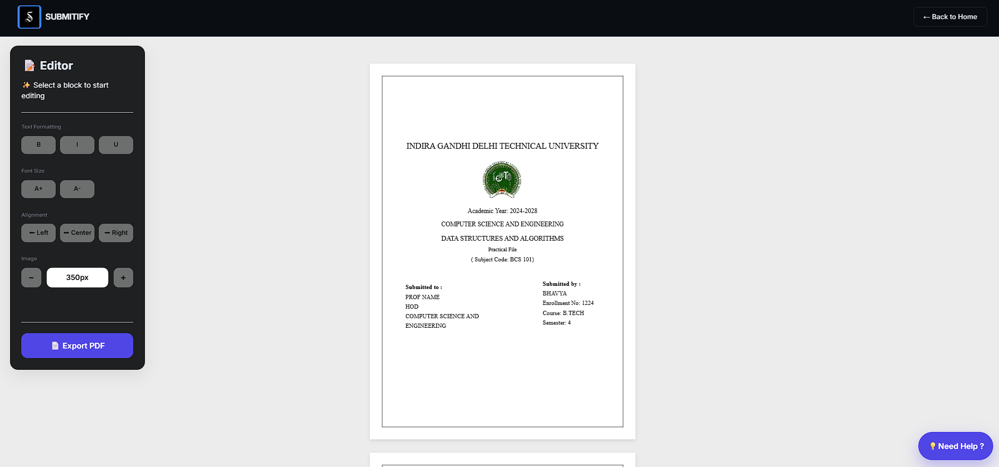
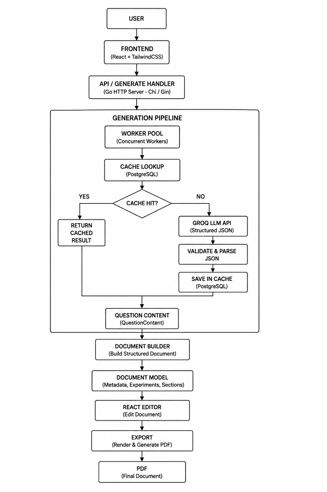

# Submitify 2.0

Submitify is an AI-powered platform for generating and editing academic documents. It automates repetitive documentation while allowing users to review, customize, and export professional-quality documents.

> **AI-powered Academic Document Generation Platform** built with
> **Go**, **React**, **PostgreSQL**, and **Groq AI**.


------------------------------------------------------------------------

##  Project Preview

### Landing Page



### List of Questions for parsing



### Review details



### Document Editor



### Architecture



------------------------------------------------------------------------

# Evolution from Submitify V1

Submitify 2.0 is a complete architectural redesign of the original
**Submitify V1**.

**V1** - AI-assisted practical file generation - Sequential generation -
Limited editing workflow - Focused primarily on programming practical
files

**V2** - ✅ Generic academic document generation platform - ✅ Rich
React document editor - ✅ Worker Pool based concurrent AI generation -
✅ PostgreSQL AI response cache - ✅ Document Model architecture - ✅
Professional PDF/DOCX export - ✅ Scalable service-oriented backend

------------------------------------------------------------------------

# Why Submitify?

Students spend hours creating laboratory files, reports and assignments.

Submitify automates repetitive documentation by combining AI-powered
content generation with a structured editor, allowing users to generate
complete academic documents in minutes while retaining full control over
the final result.

------------------------------------------------------------------------

# Features

## Smart Question Input

-   Paste questions
-   Upload question paper
-   AI-powered parsing
-   Review & edit before generation

## AI-Powered Generation

-   Document classification
-   Structured content generation
-   Groq API integration
-   Multiple document profiles

## Rich Document Editor

Unlike traditional AI generators that immediately produce a PDF,
Submitify places every generated document inside a **fully editable
React-based document editor**.

### Editor Features

-   Live document preview
-   Editable cover page
-   Editable index
-   Editable experiment sections
-   Editable code blocks
-   Rich text editing
-   Image insertion
-   Section management
-   Print-ready preview

The editor is the **Single Source of Truth**. The exported PDF is
generated from exactly the same document model shown in the editor.

## High Performance AI Pipeline

-   Worker Pool
-   Parallel generation
-   Independent retries
-   Better CPU utilization
-   Faster generation

## Intelligent PostgreSQL Cache

-   SHA-256 cache keys
-   Cache-aside pattern
-   Reuses previous AI responses
-   Lower AI cost & latency

------------------------------------------------------------------------

# Workflow

``` text
Project Details
      ↓
Question Input
      ↓
AI Question Parser
      ↓
Review Questions
      ↓
Worker Pool
      ↓
Cache Lookup
      ↓
Groq AI
      ↓
Document Builder
      ↓
Document Editor
      ↓
Export
```

------------------------------------------------------------------------

# Tech Stack

### Frontend

-   React
-   Vite
-   Tailwind CSS

### Backend

-   Go
-   net/http
-   PostgreSQL
-   pgx
-   Worker Pool
-   Docker

### AI

-   Groq API
-   Llama 3.3 70B

### Export

-   HTML Templates
-   Headless Chromium
-   PDF
-   DOCX

### Deployment

-   Vercel
-   Render
-   Neon PostgreSQL

------------------------------------------------------------------------

# Folder Structure

``` text
submitify-v2/
├── backend/
├── frontend/
├── docs/
├── images/
│   ├── architecture.png
│   ├── landing.png
│   ├── parser.png
│   ├── editor.png
│   └── export.png
├── README.md
└── ARCHITECTURE.md
```

------------------------------------------------------------------------

# Installation

``` bash
git clone https://github.com/<username>/submitify-v2.git
cd submitify-v2
```

### Backend

``` bash
cd backend
go mod tidy
go run .
```

### Frontend

``` bash
cd frontend
npm install
npm run dev
```

------------------------------------------------------------------------

# Environment Variables

Backend

``` env
GROQ_API_KEY=
DATABASE_URL=
PORT=
```

Frontend

``` env
VITE_API_URL=
```

------------------------------------------------------------------------

# Screenshots to Add

Create an `images/` folder in the repository root and add:

  Image              Purpose
  ------------------ ------------------------
  landing.png        Landing page
  parser.png         Question parser/review
  editor.png         Rich document editor
  export.png         Final exported PDF
  architecture.png   Architecture diagram
  workflow.gif       Optional demo GIF

------------------------------------------------------------------------

# Roadmap

-   User Authentication
-   Cloud Storage
-   Collaborative Editing
-   Semantic Cache
-   Analytics Dashboard
-   Multiple Templates
-   Multi-language Support

------------------------------------------------------------------------

##  Author

**Bhavya**

Built to simplify academic document creation through AI while giving
users complete control with a rich document editor.
